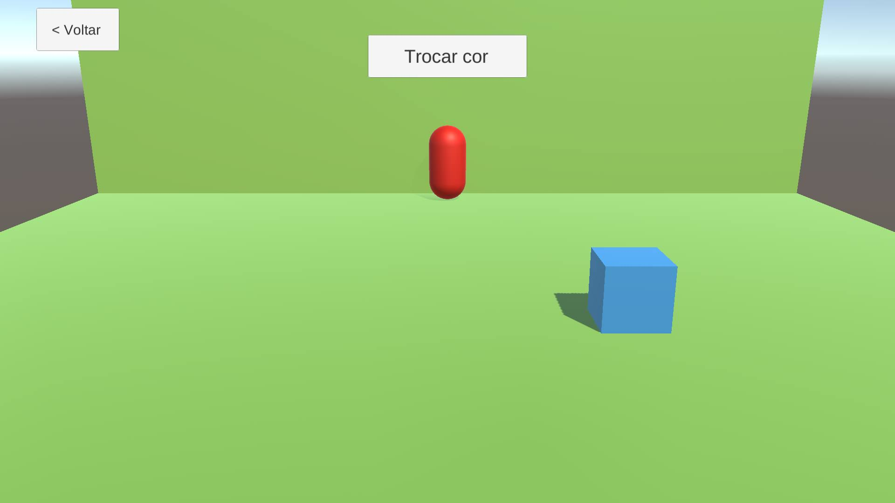
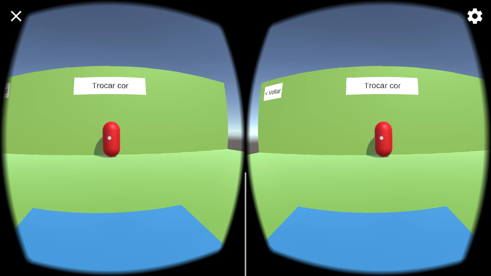
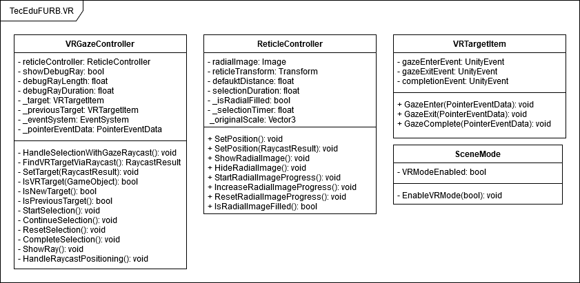

# TecEduFURB VR - Unity Package

Links para download: [Unity Package](./.github/downloads/vr_tecedu-furb.unitypackage) | [APK de exemplo (Android 9 ou mais)](./.github/downloads/vr_tecedu_furb.apk)

Este repositório fornece um **Unity Package** contendo as principais funcionalidades que uma aplicação Unity em Realidade Virtual necessita. Entre os componentes disponibilizados estão:
- Câmera VR (Prefab *VRCamera*);
- Cursor (*reticle*) para interação com objetos do mundo (Prefab *VRCamera*);
- Script que permite a interação com objetos 3D e objetos 2D (Canvas) através do cursor;
- Projeto demonstrando todas as funcionalidades.

  
  

Além do **Unity Package** o repositório também disponibiliza o APK para Android 9 do projeto de demonstração e o código fonte original utilizado para gerar o *Unity Package*. Ambos código fonte e *Unity Package* foram desenvolvidos com a Unity **2019.4.0f1**.

Os links para download do Unity Package e APK estão no início teste texto, ou também podem ser acessados pelo repositório na [página de downloads](./.github/downloads).

**IMPORTANTE:** Ao importar o *Unity Package* para o projeto também é necessário marcar a opção *Virtual Reality Suported* em *Edit -> Project Settings -> Player -> XR Settings* para que a Unity permita a utilização das configurações de VR no projeto.

## Configuração do projeto

O diagrama de classes abaixo apresenta a estruturação das classes disponibilizadas pelo *Unity Package* deste repositório. 

**Obs:** todas as variáveis privadas no diagrama que começam com *underline* são privadas e não acessíveis pelo editor da Unity, enquanto que as que começam com *underline* são privadas mas utilizam a anotação [SerializedField](colocar_link_da_doc_da_unity) para que seja possível acessá-las através do editor.

  

Além das classes apresentadas no diagrama o *Unity Package* disponibiliza um prefab chamado **VRCamera** que serve como a câmera VR que será utilizada em todas as cenas VR. 

Todas as classes apresentadas no diagrama possuem uma documentação detalhada no código explicando suas responsabilidades e como utilizá-las, porém segue uma breve descrição de cada uma. 

- ***VrGazeController*** e ***ReticleController***: são responsáveis pelo controle da interação da câmera VR com outros objetos da cena. Ambas são utilizadas pelo prefab *VRCamera* e portanto não precisam ser utilizadas diretamente, sendo necessário apenas adicionar o prefab na cena e configurar suas variáveis pelo editor caso necessário. 
- ***VRTargetItem***: serve para identificar os objetos com os quais a VRCamera pode interagir. Todos os objetos, 2D ou 3D com os quais a VRCamera possa interagir devem possuir este script anexado a eles. Também permite definir eventos através do editor que serão executados quando o objeto em questão for selecionado ou deselecionado;
- ***SceneMode***: deve estar rpesente em **todas as cenas** do projeto e serve para definir se a cena em questão estará com o modo VR ativado ou não.

**IMPORTANTE:** Ao importar o *Unity Package* para o projeto também é necessário marcar a opção *Virtual Reality Suported* em *Edit -> Project Settings -> Player -> XR Settings* para que a Unity permita a utilização das configurações de VR no projeto.